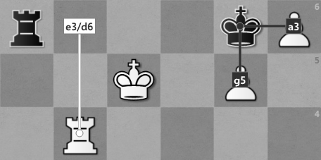

# Chess Visor



## About
Chess Visor detects chessboards on screen and creates an overlay that shows the best moves for the position. It should be used in conjunction with chess software, like [chess.com](https://www.chess.com/home) or [lichess](https://lichess.org/), and will not work with photographs of real chessboards.

Chess Visor is intended to be used as a learning device; to allow users to review the correct response to a given situation. It is **not** intended to be used to gain any sort of competitive advantage.

## Usage

Running `main.py` will start the program. The software will begin detection automatically and will create an icon in the system tray through which controls can be accessed. Note that only one screen can be monitored at a time.

## Requirements

* [Python](https://www.python.org/) compatible with TensorFlow 2.6.0 (>=3.7, <<zero-width space>3.10)

* A UCI chess engine executable, like [Stockfish](https://stockfishchess.org/download/)

* The following Python modules, potentially obtained through one of:
    * [Poetry](https://python-poetry.org/docs/basic-usage/#installing-dependencies): `$ poetry install`
    * [pip](https://pip.pypa.io/en/stable/getting-started/): `$ pip install {...packages}`

| Name | Version | Purpose | License |
|------|---------|---------|---------|
| **[chess](https://pypi.org/project/chess/)** | ^1.7.0 | Communication with engine, game utilities | [GPLv3+](https://github.com/niklasf/python-chess/blob/master/LICENSE.txt) |
| **[keyboard](https://pypi.org/project/keyboard/)** | ^0.13.5 | Hotkey for toggling activity | [MIT](https://github.com/boppreh/keyboard/blob/master/LICENSE.txt) |
| **[mss](https://pypi.org/project/mss/)** | ^6.1.0 | Taking screenshots | [MIT](https://github.com/BoboTiG/python-mss/blob/master/LICENSE) |
| **[numpy](https://pypi.org/project/numpy/)** | >=1.19.2, <1.20.0 | Efficient numeric operations | [BSD](https://github.com/numpy/numpy/blob/main/LICENSE.txt) |
| **[Pillow](https://pypi.org/project/Pillow/)** | ^8.4.0 | Generating procedural training data | [HPND](https://github.com/python-pillow/Pillow/blob/main/LICENSE) |
| **[PySide6](https://pypi.org/project/PySide6/)** | ^6.2.1 | GUI elements; overlay, tray icon, settings window | [LGPLv3](https://www.gnu.org/licenses/lgpl-3.0.en.html) |
| **[pytomlpp](https://pypi.org/project/pytomlpp/)** | ^1.0.6 | I/O for settings and training files | [MIT](https://github.com/bobfang1992/pytomlpp/blob/master/LICENSE) |
| **[scikit-image](https://pypi.org/project/scikit-image/)** | ^0.18.3 | Transforming images for vision | [Modified BSD](https://github.com/scikit-image/scikit-image/blob/main/LICENSE.txt) |
| **[tensorflow](https://pypi.org/project/tensorflow/)** | ^2.7.0 | Neural network for tile classification | [Apache 2.0](https://github.com/tensorflow/tensorflow/blob/master/LICENSE) |

## Tile Classification

Chess Visor uses a convolutional neural network to classify the tiles of the chessboard. A trained model is included in the `tile_classifier/model` directory.

If the user wishes, they can train the network themselves. All that's required is a set of piece images placed in each of the subdirectories of `tile_classifier/training`. The program will procedurally generate training data using these images. For optimal results, there should be many versions of each piece/color combination. Images should be PNG files with transparent backgrounds (e.g. [Cburnett's chess pieces](https://commons.wikimedia.org/wiki/Category:SVG_chess_pieces)) and must follow the naming scheme `{color_id}{piece_id}-{version_index}.png`, where color and piece identifiers follow [Forsyth–Edwards Notation](https://en.wikipedia.org/wiki/Forsyth%E2%80%93Edwards_Notation). For example:

```
chess-visor
└── tile_classifier
    └── training
        └── bishop
            ├── bb-0.png
            ├── wb-0.png
            ├── bb-1.png
            ├── wb-1.png
            ├── ...
        └── ...
```

Once assembled, set `nPieceVersions` in `tile_classifier/training/meta.toml` to the number of piece versions provided in the subdirectories. Training should begin automatically if the program is run when there is no `tile_classifier/model` directory.

## License

The screenshot at the top of this document (`docs/example.png`) contains a board graphic from <a href="https://lichess.org/">lichess</a> and the Cardinal piece set from <a href="https://github.com/ornicar/lila/blob/master/COPYING.md">sadsnake1</a>.

The included font, [Selawik](https://docs.microsoft.com/en-us/typography/font-list/selawik), is Copyright © 2015 [Microsoft Corporation](https://www.microsoft.com/en-us/) and is used here under the SIL Open Font License.

All other contents are Copyright © 2021 [dGrowl](https://github.com/dGrowl).
